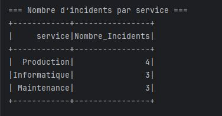

# Traitement des incidents

Ce projet est réalisé avec **Apache Spark (Java)**.  
Il permet de traiter un fichier CSV contenant des incidents par service, en utilisant **Spark SQL**.

---

## Objectifs du projet

### 1. Afficher le nombre d’incidents par service

### 2. Afficher les deux années où il y a eu le plus d'incidents

---

